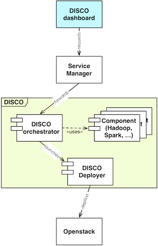

DISCO is built as a framework made of two main components, the dashboard serving as a user interface and the backend performing the actual workflows.

Under the Wiki section, a complete guide for the deployment of both components is provided. Which is actually very easy.

### Extensible...
Is there a framework of your needs which is not deployed by DISCO yet? You are lucky for the fact that DISCO is unbelievably easy to extend! But more about that in the [Wiki]({{ site.github.repobackend }}/wiki).
